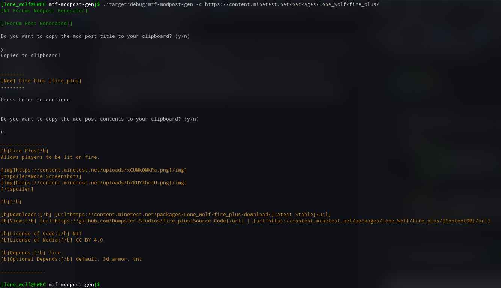

# Minetest Modpost Generator

A CLI-based forum topic generator I use for easily creating consistent mod posts for all of my mods on the Minetest Forums

There is currently a question-based and cdb-pulling method for generation.

Screenshot of my terminal when generating a mod post:

